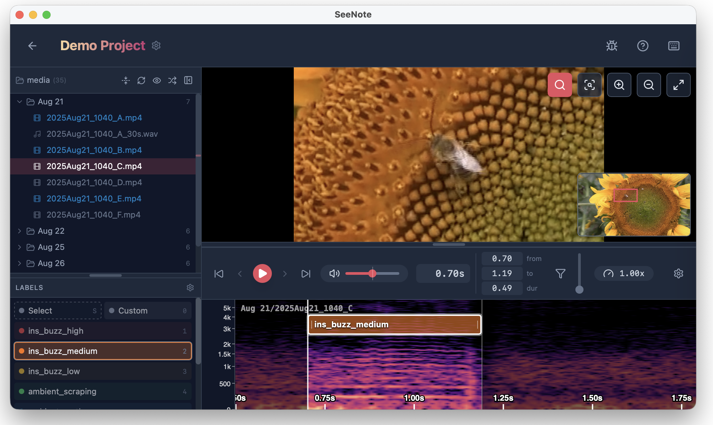

# SeeNote - Audio/Video Event Annotation



[](https://github.com/LukeHearon/SeeNote/releases/latest)

SeeNote is a tool for annotating events in audio and video files.
I'm developing SeeNote to facilitate building training data for [buzzdetect](https://github.com/OSU-Bee-Lab/buzzdetect) models;
as such, it's primarily oriented towards bioacoustic data.


### Warning: vibes
I'm creating SeeNote pretty much entirely via LLMs. I don't know typescript, rust, react, or any other language this thing uses.
I am, however, paying a lot of attention to the user experience, documentation, and overall polish; and I do use this tool in my regular bioacoustics work.
As such, I can 


## Install

[](https://github.com/LukeHearon/SeeNote/releases/latest/download/SeeNote-macOS.dmg)
[](https://github.com/LukeHearon/SeeNote/releases/latest/download/SeeNote-Windows.exe)
[](https://github.com/LukeHearon/SeeNote/releases/latest/download/SeeNote-Linux.AppImage)

On macOS, you can also install via [Homebrew](https://brew.sh/):

```sh
brew install --cask LukeHearon/seenote/seenote
```

Mac users will have to fight against macOS to open SeeNote. More on that [below](#macos-woes).

## Overview

SeeNote follows a project-based workflow. Pick a folder to serve as your project folder. A `.seenote` subdirectory will be made to store project metadata. Within that folder, point SeeNote at a folder containing your media files (audio, video) and another where you want your annotations to be written. SeeNote aims to be a frictionless annotation experience, automating and streamlining away all of the little frustrations I've run into during my data labeling efforts. It's easy to navigate within and between tracks, tools are bound to hotkeys for quick-access, annotation files are updated automatically, and you can save your most common labels as predefined annotation tools. 

## Features
- User-definable annotation tools allow quick, repeated labeling. Hotkeys make them quick to place, color coding makes them quick to read. You can even rename a tool and all associated annotations will be updated across the project.
- The "Custom" annotation tool allows you to label one-off events
- Click on a label or select a region to play back only that selection, letting you fine-tune annotation boundaries. Text entry allows you to edit the selected region or annotation to exact-second extents.
- Auto Save! Every change to annotations is immediately saved to disk.
- Audio filtering allows you to isolate sounds of interest and block out noise, with adjustable filtering strength.
- Playback speed can be adjusted on-the-fly (preserving pitch!) to plow through audio more quickly or get a slowed-down view of a fast-flying insect. You can also single-frame scrub video using `,` and `.`.
- Zoom in tight to video to get a closer look.
- And so much more!

## macOS woes

SeeNote is not code-signed, because I cannot afford the developer licenses.
Because of this, macOS helpfully pitches a tantrum when you try to use this tool.
Here's how to get past the worst of it:

1. Install SeeNote to `/Applications` (drag from DMG or use homebrew).
2. Open SeeNote. You'll see a "SeeNote.app" Not Opened popup.
    - Click "Done"
3. Open System Settings → Privacy & Security, scroll to the Security section near the bottom. You should see ""SeeNote.app" was blocked to protect your Mac".
    - Click "Open Anyway"
4. In one last bid to stop you from working, macOS will throw up a dialoge titled "Open "SeeNote.app"?
    - Click "Open Anyway"

You will only have to do this once. Thank goodness.
However, each time you open a project, you'll need to approve reading from the folder it's contained in.

