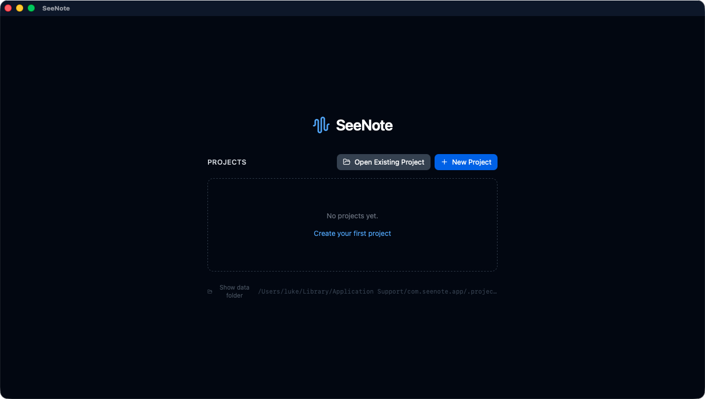
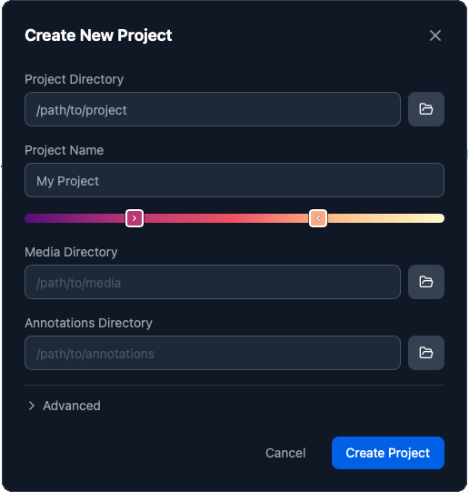
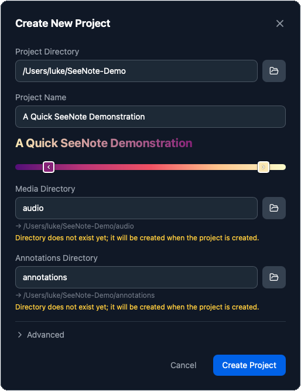
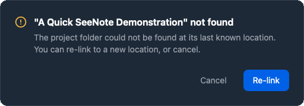
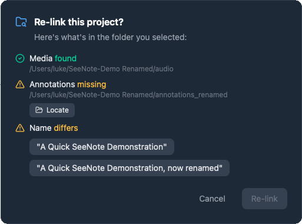
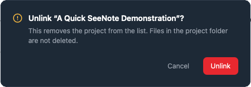
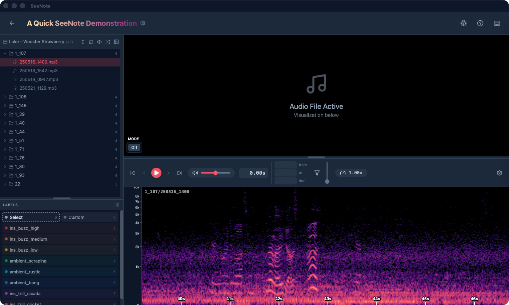
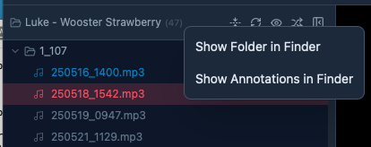
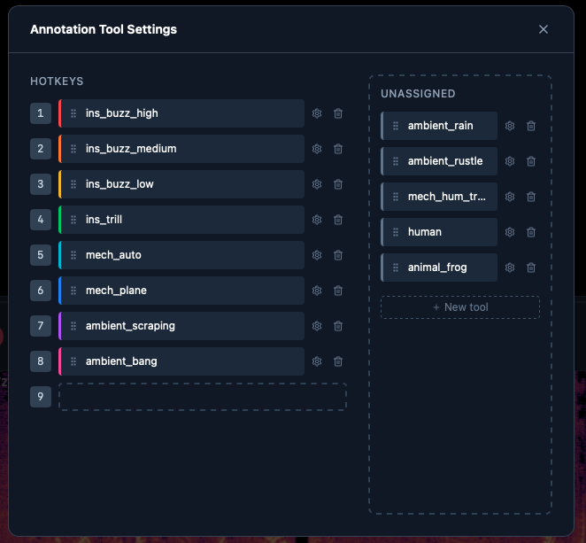
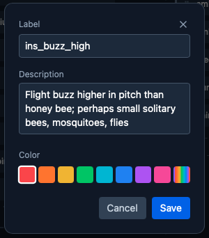

## SeeNote projects

SeeNote is organized around projects. Generally, a project has the
following components:

1. A directory of media (audio and/or video) to be annotated
2. A directory for annotations to be saved to
3. Project-specific settings, such as spectrogram visualization
   settings, annotation tools, etc.

Project settings are saved in the folder you designate as the Project
Directory, stored in a `.seenote/` subdirectory.

Ideally, a project is fully self-contained, but you may already have
your audio stored in a different location that you don't want to copy or
symlink. That's okay! SeeNote can handle external directories for
annotations and audio. It will, however, mean your project isn't
portable, because you can't zip the whole thing up and move it to a new
machine, and SeeNote will warn you to this effect.

### Setting up a new project

If you need to create a new project for your annotations, follow these
steps to create one.

If you've been given a project folder and you need to connect it to
SeeNote, simply click the "Open Existing Project" button, navigate to
the project folder, and open it.

1. Launch SeeNote

   

2. Select "+ New Project"

   
   Enter the project information:

   a. **Project Directory:** the parent folder that holds your media
      (audio, video) and annotations folders. This is where the
      project settings will be saved. If it doesn't yet exist, you can
      create it through the file browser button.
   b. **Project Name:** whatever you like; this is what will show up
      in the list of projects on the start screen.
   c. **Colors:** have fun with it. This is just to differentiate
      projects on the start screen. Right click a handle for a
      surprise.
   d. **Media Directory:** the folder holding all of your audio and
      video files. If an "audio" or "media" folder already exists
      within your project directory, SeeNote will automatically fill
      this field.
   e. **Annotations Directory:** the folder that will hold all of your
      annotations; SeeNote suggests simply "annotations" as a default.

3. You're done! Create your project.

### If the project folder moves...

If you rename or move the project folder, SeeNote won't be able to find
it.

A Re-link dialogue lets you browse to the new location and restore the
project in your launch screen. If there are any conflicts between the
project in your list and the project that you're re-linking, SeeNote
will ask you to resolve them.

### Unlinking a project

Within SeeNote, you can unlink projects so they don't show up in the
launch screen. However, SeeNote cannot delete project data from your
computer. You must do this yourself, manually. This protects critical
project data from accidental deletion.

## Annotation Screen

### Top Bar

- **Back button:** press to return to the Projects Screen
- **Project name and gear icon:** click to open project settings, the ones
  you set when creating the project
- **Bug icon:** debug panel, for troubleshooting
- **Question mark icon:** help menu
- **Keyboard icon:** keyboard shortcuts

### File Browser

This panel shows all of the media files discovered in the media
directory. The active file is highlighted. Files with annotations show
up with blue text (white text, when they're the active track).

- **File icon with media dir name:** right click this for the option to show
  the root annotations or media dirs

  

- **Collapse/expand button:** close or open all folders
- **Refresh button:** if files change during annotation, click this button
  to pick up the changes
- **Eye / crossed-out-eye / filter icon:** this icon toggles through view
  states, showing all files, un-annotated files, or showing only
  annotated files
- **Shuffle icon:** enters shuffle mode, used for annotating many small
  files. Tracks are placed in random order
- **Collapse button:** collapses the file tree and annotation palette to
  give the spectrogram more space

### Annotation Tools Palette

This palette shows all of your available annotation tools, their colors,
and their bound hotkeys. You can click the tools to activate them, but
you should really just use the hotkeys instead!

Mousing over the tools gives a tooltip showing their description.

Click the gear icon at top right to open the Annotation Tools Settings.

### Annotation Tools Settings

On this screen, you can drag and drop annotations to re-bind their
hotkeys, or you can un-assign them from hotkeys. Unassigning an
annotation tool doesn't delete it or its corresponding annotations, it
just stashes it to free up a hotkey.

### Editing an annotation tool

Each annotation tool has its own settings. These consist of:

- **Label:** the name of the annotation; changing the label will update the
  names of all corresponding annotations across the project.
- **Description:** a short description of when to use the label
- **Color:** the color of the annotation on the spectrogram track

### Toolbar

::: {.callout-note}
## Under construction!
:::

### Video Panel

::: {.callout-note}
## Under construction!
:::

### Timeline Panel

::: {.callout-note}
## Under construction!
:::
