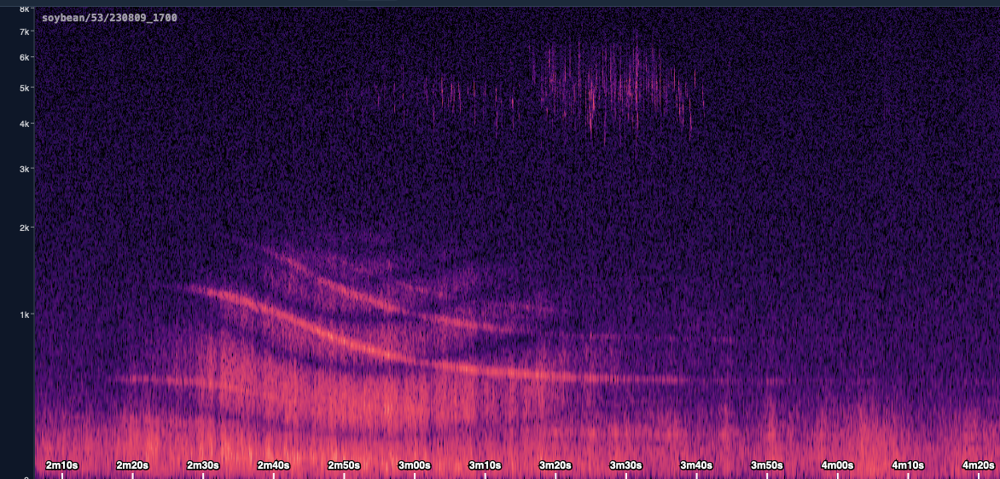

The following is a good workflow for producing high-quality annotations using SeeNote.

## TL;DR
- **Listen to every second of the track.** Annotating visually, based on the spectrogram, is okay as a start, but is not acceptable for the finished state.
- **Ensure labels are tight to the event.** Annotations should start exactly when the event starts and end exactly when it ends. No slop. Check by repeatedly playing through the active selection and nudging the selection handles.

## Step 0: spectrogram configuration

The default spectrogram settings should be a good starting place, but
may need tweaking to improve visualization. Try the following tweaks:

- **Level Range:** this controls how colors map onto amplitudes in the
  spectrogram. Pulling the bottom handle upwards will darken the
  background, causing low-volume elements to drop out. Pulling the top
  handle downwards will brighten high-volume events, which can help them
  stand out. Pulling it upwards will darken high-volume events, which
  can be helpful when there are a lot of loud events in the file.

- **Frequency (Hz):** this controls the Y-axis extent of the
  spectrogram. Most of the signal from a bee buzz lives within (200 Hz,
  3000 Hz), but you'll want to leave it more zoomed out for context and
  to see other sounds. Cricket trills may not be visible at the default
  max of 10,000 Hz. It can be helpful to increase the max frequency to
  visually check for the presence of very-high-pitched sounds. It is
  surprisingly easy to not hear what you cannot see.

- **FFT**
  - **Window size:** controls spectrogram visualization. High values give a
    lot of resolution on the Y axis (easier to tell frequencies apart),
    but smear the X axis (more difficult to tell times apart). Low
    values do the opposite.
  - **Scale:** you probably want to leave this on Mel, which is the nicest
    visualization. Linear gives a 1:1 map of frequencies to the Y axis,
    which squishes high-frequency events together. Logarithmic can look
    okay if you set the Min frequency up a little, around 100 Hz.

## Step 1: long-duration events

{width="6.5in"}

While you must listen to every second of the audio file, it's helpful to
drop labels on easily-visible events before you begin listening. For
example, a passing plane will register strongly on the spectrogram and
could last more than a minute. Press **Ctrl+0** to completely zoom out,
fitting the whole spectrogram into view (it may take a short while for your
computer to render the whole spectrogram). Pre-annotate any events you
recognize. If an event is continuous across the file, press **Ctrl+A**
to highlight the entire extent and drop the corresponding label.

::: {.callout-note}
## 
## Repeating, discontinuous events
If there's an event that repeats across the whole file, but there's space between the events —
e.g. a cricket chirping once every three seconds — you may,
unfortunately, need to annotate every event individually. Events
further than ~0.5 s from each other should be annotated individually.
:::

As you listen to the track, you must update the annotations you made in advance.
If you pre-labeled a passing plane, you may find that it's still audible longer
than you expected from the spectrogram; you must then extend it. You may
realize that what you labeled as a plane was actually a car. You must
remember to update the label.

::: {.callout-note}
## Judgement calls
Some events are a judgement call. A passing jet plane can easily produce
a minutes-long event. The volume slowly decreases as the event goes on
until you can't really hear the sound, but you can tell it's there
because you know that a plane was passing. There's no good way to choose
where to end the label.
:::

## Step 2: listen to the whole shebang

Once you've labeled long-form events, zoom in so that the window covers
about 10 seconds of audio.

1. Play the track with **spacebar**.
2. Let the audio play and listen closely for events.
3. When you hear an event, pause the audio.
   a. Click and drag to highlight the event from start to finish.
      - Labels must be **tight**. That means there's no slop between the
        limits of the labels and the limits of the event.
      - If you have an annotation tool active, it will automatically
        drop a label for you.
   b. After the highlight is made, you can drag the ends to precisely
      mark the event.
      - If you already dropped a label, its extent will be modified
        as you adjust the selection.
   c. Press play a few times to listen through the selected range.
      Does it capture the whole event? Is it tight to the event?
   d. If you have not yet dropped a label, press the number key
      corresponding to the annotation you would like to use. If you
      would like to change the annotation, just press the key for the
      corresponding annotation.
   e. If an event does not fit any of the existing labels, make your
      own with discretion. Use the Custom Annotation tool and type in
      a label.
   f. Jump back before the start of the event and resume playback; as
      it plays through your label, confirm that the label is tight.
4. Proceed to play through the audio until you have labeled every
   event.
